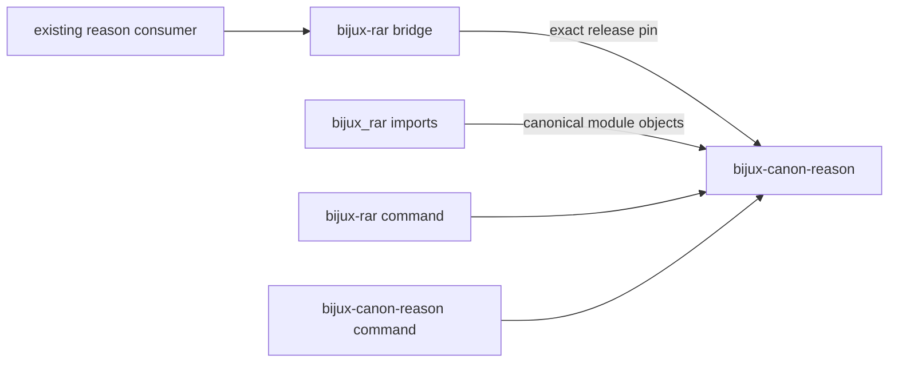

# bijux-rar

<!-- bijux-canon-badges:generated:start -->
[](https://pypi.org/project/bijux-rar/)
[-0A7BBB)](https://pypi.org/project/bijux-rar/)
[](https://github.com/bijux/bijux-canon/blob/main/LICENSE)
[](https://github.com/bijux/bijux-canon/actions/workflows/verify.yml?query=branch%3Amain)
[](https://github.com/bijux/bijux-canon)

[](https://pypi.org/project/bijux-rar/)
[](https://pypi.org/project/bijux-canon-runtime/)
[](https://pypi.org/project/bijux-canon/)
[](https://pypi.org/project/bijux-canon-agent/)
[](https://pypi.org/project/bijux-canon-ingest/)
[](https://pypi.org/project/bijux-canon-reason/)
[](https://pypi.org/project/bijux-canon-index/)
[](https://pypi.org/project/agentic-flows/)
[](https://pypi.org/project/bijux-agent/)
[](https://pypi.org/project/bijux-rag/)
[](https://pypi.org/project/bijux-vex/)

[](https://github.com/bijux/bijux-canon/pkgs/container/bijux-canon%2Fbijux-rar)
[](https://github.com/bijux/bijux-canon/pkgs/container/bijux-canon%2Fbijux-canon-runtime)
[](https://github.com/bijux/bijux-canon/pkgs/container/bijux-canon%2Fbijux-canon)
[](https://github.com/bijux/bijux-canon/pkgs/container/bijux-canon%2Fbijux-canon-agent)
[](https://github.com/bijux/bijux-canon/pkgs/container/bijux-canon%2Fbijux-canon-ingest)
[](https://github.com/bijux/bijux-canon/pkgs/container/bijux-canon%2Fbijux-canon-reason)
[](https://github.com/bijux/bijux-canon/pkgs/container/bijux-canon%2Fbijux-canon-index)
[](https://github.com/bijux/bijux-canon/pkgs/container/bijux-canon%2Fagentic-flows)
[](https://github.com/bijux/bijux-canon/pkgs/container/bijux-canon%2Fbijux-agent)
[](https://github.com/bijux/bijux-canon/pkgs/container/bijux-canon%2Fbijux-rag)
[](https://github.com/bijux/bijux-canon/pkgs/container/bijux-canon%2Fbijux-vex)

[](https://bijux.io/bijux-canon/06-bijux-canon-runtime/)
[](https://bijux.io/bijux-canon/05-bijux-canon-agent/)
[](https://bijux.io/bijux-canon/02-bijux-canon-ingest/)
[](https://bijux.io/bijux-canon/04-bijux-canon-reason/)
[](https://bijux.io/bijux-canon/03-bijux-canon-index/)
<!-- bijux-canon-badges:generated:end -->

`bijux-rar` preserves an earlier distribution and Python import root for
[`bijux-canon-reason`](../bijux-canon-reason/README.md). It keeps existing
reasoning consumers operational while problem plans, structured claims,
evidence references, verification, traces, and provenance remain owned by the
canonical package.

The bridge contains no independent inference or verification engine.

## Install

```bash
python3.11 -m pip install bijux-rar
bijux-rar --help
python3.11 -m bijux_rar --help
```

The built wheel pins `bijux-canon-reason` to the exact bridge release. The
canonical distribution itself also publishes `bijux-rar` alongside
`bijux-canon-reason`, both targeting the same application. The old command can
therefore remain available after the dependency name changes; Python imports
still require deliberate migration to `bijux_canon_reason`.

## Identity Map

| Consumer surface | Preserved identity | Canonical identity |
| --- | --- | --- |
| distribution | `bijux-rar` | `bijux-canon-reason` |
| Python package | `bijux_rar` | `bijux_canon_reason` |
| preferred command | `bijux-rar` | `bijux-canon-reason` |
| module execution | `python -m bijux_rar` | `python -m bijux_canon_reason` |
| CLI module | `bijux_rar.interfaces.cli` | `bijux_canon_reason.interfaces.cli` |
| representative claim type | `bijux_rar.core.Claim` | `bijux_canon_reason.core.Claim` |



## Reasoning Semantics

The compatibility facade exposes the canonical package's declared root
exports and maps nested aliases to canonical module objects. A `Claim`
imported through either root is consequently the same class, avoiding parallel
types in validators, registries, and serializers.

The bridge command and module entrypoint call the canonical reason application
without translating plans, evidence, failures, output, or exit status. The
canonical package remains the sole authority for acceptance and refusal
semantics. This includes the `research`, `inspect`, `verify --research-id`,
`replay --research-id`, and `compare` operations, which all use the canonical
`ResearchApplicationService` and its manifested record.

## Verify A Consumer

Verify both type and behavior boundaries:

```python
from bijux_rar import Claim as CompatibilityClaim
from bijux_canon_reason import Claim as CanonicalClaim

assert CompatibilityClaim is CanonicalClaim
```

```bash
bijux-rar --help
bijux-canon-reason --help
python3.11 -m bijux_rar --help
```

Run representative accepted and refused cases and compare claim structure,
evidence references, validation findings, provenance, trace output, and exit
status. Command availability alone does not prove evidence semantics or
historical artifact readability.

## Migrate Evidence-Bearing Consumers

New code should depend on `bijux-canon-reason`, import
`bijux_canon_reason`, and prefer `bijux-canon-reason`. For existing consumers:

1. replace dependency declarations and lock-file entries;
2. replace root and nested imports;
3. replace the old command where canonical naming is required, recognizing
   that the canonical distribution still exposes `bijux-rar`;
4. inspect plans, plugins, configuration, serialized dotted paths, claim and
   trace readers, and schema assumptions;
5. validate representative accepted and refused cases with retained evidence;
   and
6. remove the bridge distribution after no deployed consumer imports
   `bijux_rar` or independently requests `bijux-rar`.

Alias resolution does not freeze private modules or every historical evidence
representation as public API.

## Read Next

- [Reason handbook](https://bijux.io/bijux-canon/04-bijux-canon-reason/)
  for claim and verification semantics
- [Compatibility contract](https://bijux.io/bijux-canon/08-compat-packages/catalog/bijux-rar/)
  for the dual-command boundary
- [Migration guidance](https://bijux.io/bijux-canon/08-compat-packages/migration/migration-guidance/)
  for consumer inventory and acceptance
- [Retired repository](https://github.com/bijux/bijux-rar) for historical
  context
- [Package changelog](https://github.com/bijux/bijux-canon/blob/main/packages/compat-bijux-rar/CHANGELOG.md) for release history
