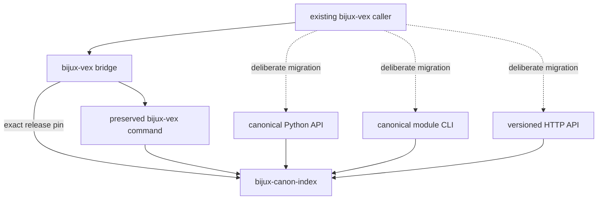

# bijux-vex

<!-- bijux-canon-badges:generated:start -->
[](https://pypi.org/project/bijux-vex/)
[-0A7BBB)](https://pypi.org/project/bijux-vex/)
[](https://github.com/bijux/bijux-canon/blob/main/LICENSE)
[](https://github.com/bijux/bijux-canon/actions/workflows/verify.yml?query=branch%3Amain)
[](https://github.com/bijux/bijux-canon)

[](https://pypi.org/project/bijux-vex/)
[](https://pypi.org/project/bijux-canon-runtime/)
[](https://pypi.org/project/bijux-canon/)
[](https://pypi.org/project/bijux-canon-agent/)
[](https://pypi.org/project/bijux-canon-ingest/)
[](https://pypi.org/project/bijux-canon-reason/)
[](https://pypi.org/project/bijux-canon-index/)
[](https://pypi.org/project/agentic-flows/)
[](https://pypi.org/project/bijux-agent/)
[](https://pypi.org/project/bijux-rag/)
[](https://pypi.org/project/bijux-rar/)

[](https://github.com/bijux/bijux-canon/pkgs/container/bijux-canon%2Fbijux-vex)
[](https://github.com/bijux/bijux-canon/pkgs/container/bijux-canon%2Fbijux-canon-runtime)
[](https://github.com/bijux/bijux-canon/pkgs/container/bijux-canon%2Fbijux-canon)
[](https://github.com/bijux/bijux-canon/pkgs/container/bijux-canon%2Fbijux-canon-agent)
[](https://github.com/bijux/bijux-canon/pkgs/container/bijux-canon%2Fbijux-canon-ingest)
[](https://github.com/bijux/bijux-canon/pkgs/container/bijux-canon%2Fbijux-canon-reason)
[](https://github.com/bijux/bijux-canon/pkgs/container/bijux-canon%2Fbijux-canon-index)
[](https://github.com/bijux/bijux-canon/pkgs/container/bijux-canon%2Fagentic-flows)
[](https://github.com/bijux/bijux-canon/pkgs/container/bijux-canon%2Fbijux-agent)
[](https://github.com/bijux/bijux-canon/pkgs/container/bijux-canon%2Fbijux-rag)
[](https://github.com/bijux/bijux-canon/pkgs/container/bijux-canon%2Fbijux-rar)

[](https://bijux.io/bijux-canon/06-bijux-canon-runtime/)
[](https://bijux.io/bijux-canon/05-bijux-canon-agent/)
[](https://bijux.io/bijux-canon/02-bijux-canon-ingest/)
[](https://bijux.io/bijux-canon/04-bijux-canon-reason/)
[](https://bijux.io/bijux-canon/03-bijux-canon-index/)
<!-- bijux-canon-badges:generated:end -->

`bijux-vex` preserves an earlier distribution, Python import root, and console
command for [`bijux-canon-index`](../bijux-canon-index/README.md). The canonical
package owns execution planning, capability resolution, state backends, ranked
results, provenance, explanation, comparison, and replay.

This bridge has an intentional asymmetry: `bijux-canon-index` publishes no
canonical console script. There is no `bijux-canon-index` executable to use as
a mechanical rename for `bijux-vex`.

## Install

```bash
python3.11 -m pip install bijux-vex
bijux-vex --help
python3.11 -m bijux_vex --help
```

The built wheel pins `bijux-canon-index` to the exact bridge release. The
preserved command delegates to the canonical Typer application, but its
availability is a compatibility guarantee rather than a new canonical command
contract.

## Identity Map

| Consumer surface | Preserved identity | Canonical identity |
| --- | --- | --- |
| distribution | `bijux-vex` | `bijux-canon-index` |
| Python package | `bijux_vex` | `bijux_canon_index` |
| console command | `bijux-vex` | no direct console replacement |
| module execution | `python -m bijux_vex` | `python -m bijux_canon_index.interfaces.cli.app` |
| CLI module | `bijux_vex.interfaces.cli.app` | `bijux_canon_index.interfaces.cli.app` |
| representative plan type | `bijux_vex.core.runtime.execution_plan.ExecutionPlan` | `bijux_canon_index.core.runtime.execution_plan.ExecutionPlan` |



## Index Semantics

The compatibility root mirrors the canonical package's declared exports.
Nested alias paths resolve to canonical modules, so an `ExecutionPlan`
imported through either name is the same class rather than a wrapper type.

The bridge command calls the canonical index Typer application. It does not
rewrite capability profiles, execution contracts, backend selection, ranking,
typed failures, provenance, artifacts, or replay verdicts.

## Verify A Consumer

Confirm type identity for Python integrations:

```python
from bijux_vex.core.runtime.execution_plan import (
    ExecutionPlan as CompatibilityPlan,
)
from bijux_canon_index.core.runtime.execution_plan import (
    ExecutionPlan as CanonicalPlan,
)

assert CompatibilityPlan is CanonicalPlan
```

```bash
bijux-vex --help
python3.11 -m bijux_vex --help
python3.11 -m bijux_canon_index.interfaces.cli.app --help
```

For execution acceptance, compare capability resolution, plan and configuration
fingerprints, ranked result order and scores, typed failures, provenance,
artifact identity, and replay or comparison verdicts.

## Replace Command Integrations Deliberately

New Python code should install `bijux-canon-index` and import
`bijux_canon_index`. A command caller must choose a supported boundary rather
than inventing a `bijux-canon-index` executable:

- call the documented Python facade for in-process integration;
- invoke `python -m bijux_canon_index.interfaces.cli.app` when the module CLI
  is the correct operational boundary; or
- adopt the versioned HTTP API for a service boundary.

Inventory every command operation, input, configuration source, exit-code
assumption, and consumed output before replacing it. Keep `bijux-vex` installed
until all deployed command callers have moved and representative results have
been compared under the intended determinism or bounded-approximation policy.

Alias identity does not freeze private modules, private CLI behavior, or all
historical artifact layouts.

## Read Next

- [Index handbook](https://bijux.io/bijux-canon/03-bijux-canon-index/)
  for execution, artifacts, and replay semantics
- [Compatibility contract](https://bijux.io/bijux-canon/08-compat-packages/catalog/bijux-vex/)
  for the command asymmetry and preserved identities
- [Migration guidance](https://bijux.io/bijux-canon/08-compat-packages/migration/migration-guidance/)
  for consumer inventory and acceptance
- [Retired repository](https://github.com/bijux/bijux-vex) for historical
  context
- [Package changelog](https://github.com/bijux/bijux-canon/blob/main/packages/compat-bijux-vex/CHANGELOG.md) for release history
